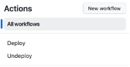

# Kafka Topic Record Picker Application
The Kafka Topic Record Picker Application is a simple application that reads records from a Kafka topic and allows the user to specify a specific offset to pick out a reccord from a Kafka topic.  The application is written in Python and uses the `confluent_kafka` library to read records from a Kafka topic.

**Table of Contents**

<!-- toc -->
+ [**1.0 Let's get started!**](#10-lets-get-started)
    - [**1.1 DevOps in Action: Running Terraform Locally**](#11-devops-in-action-running-terraform-locally)
        + [**1.1.1 Run locally**](#111-run-locally)
    - [**1.2 DevOps in Action: Running Terraform in the cloud**](#12-devops-in-action-running-terraform-in-the-cloud)
        + [**1.2.1 Run from the cloud**](#121-run-from-the-cloud)
    - [**1.3 Visualizing the Terraform Configuration**](#13-visualizing-the-terraform-configuration)
+ [**2.0 Resources**](#20-resources)
+ [**3.0 Important Note(s)**](#30-important-notes)
<!-- tocstop -->

## 1.0 Let's get started!

**These are the steps**

1. Take care of the cloud and local environment prequisities listed below:
    > You need to have the following cloud accounts:
    > - [AWS Account](https://signin.aws.amazon.com/) *with SSO configured*
    > - [Confluent Cloud Account](https://confluent.cloud/)
    > - [GitHub Account](https://github.com) *with OIDC configured for AWS*
    > - [Terraform Cloud Account](https://app.terraform.io/)

    > You need to have the following installed on your local machine:
    > - [AWS CLI version 2](https://docs.aws.amazon.com/cli/latest/userguide/getting-started-install.html)
    > - [Confluent CLI version 3 or higher](https://docs.confluent.io/confluent-cli/4.0/overview.html)
    > - [Python 3.11.9](https://www.python.org/downloads/release/python-3119/)
    > - [Terraform CLI version 1.9.3 or higher](https://developer.hashicorp.com/terraform/install)

2. Clone the repo:
    ```bash
    git clone https://github.com/j3-signalroom/kafka-topic_record_picker-python_app.git
    ```

3. Set up your Terraform Cloud environment locally or leverage GitHub Actions to create the complete setup effortlessly. Here's what you can expect:

    - A Confluent Cloud environment featuring a Kafka Cluster, fully equipped with pre-configured example Kafka topics—ready to power your data streaming needs.

    - AWS Secrets Manager securely storing API Key Secrets for the Kafka Cluster, along with AWS Systems Manager Parameter Store containing Kafka Consumer and Producer properties for easy integration.

With these steps, you'll have everything set up to run enterprise-grade data streaming applications in no time!

### 1.1 DevOps in Action: Running Terraform Locally
Install the [Terraform CLI](https://developer.hashicorp.com/terraform/tutorials/aws-get-started/install-cli) on your local machine, and make sure you have an [HCP Terraform account](https://app.terraform.io/session) to run the Terraform configuration.  Learn how to set up Terraform Cloud for local use by clicking [here](.blog/setup-terraform-cloud.md).

#### 1.1.1 Run locally
```bash
./run-terraform-locally.sh <create | delete> --profile=<SSO_PROFILE_NAME>
                                             --confluent-api-key=<CONFLUENT_API_KEY>
                                             --confluent-api-secret=<CONFLUENT_API_SECRET>
                                             --day-count=<DAY_COUNT>
                                             --auto-offset-reset=<earliest | latest>
                                             --number-of-api-keys-to-retain=<NUMBER_OF_API_KEYS_TO_RETAIN>
```
> Argument placeholder|Replace with
> -|-
> `<SSO_PROFILE_NAME>`|your AWS SSO profile name for your AWS infrastructue that host your AWS Secrets Manager.
> `<CONFLUENT_API_KEY>`|your organization's Confluent Cloud API Key (also referred as Cloud API ID).
> `<CONFLUENT_API_SECRET>`|your organization's Confluent Cloud API Secret.
> `<DAY_COUNT>`|how many day(s) should the API Key be rotated for.
> `<AUTO_OFFSET_RESET>`|Use `earliest`, when you want to read the first event in a Kafka topic.  Otherwise, specify `latest`.
> `<NUMBER_OF_API_KEYS_TO_RETAIN>`|Specifies the number of API keys to create and retain.

To learn more about this script, click [here](.blog/run-terraform-locally-script-explanation.md).

### 1.2 DevOps in Action: Running Terraform in the cloud
In order to run the Terraform configuration from GitHub, the Terraform Cloud API token and Confluent Cloud API Key are required as GitHub Secret variables.  Learn how to do to get the Terraform Cloud API token and Confluent Cloud API key [here](.blog/setup-github.md).

#### 1.2.1 Run from the cloud
Follow these steps:

a. **Deploy the Repository**: Ensure that you have cloned or forked the repository to your GitHub account.

b. **Set Required Secrets and Variables**: Before running any of the GitHub workflows provided in the repository, you must define at least the `AWS_DEV_ACCOUNT_ID` variable (which should contain your AWS Account ID for your development environment). To do this:

- Go to the **Settings** of your cloned or forked repository in GitHub.

- Navigate to **Secrets and Variables** > **Actions**.

- Add the `AWS_DEV_ACCOUNT_ID` and any other required variables or secrets.

c. **Navigate to the Actions Page**:

- From the cloned or forked repository on GitHub, click on the **Actions** tab.

d. **Select and Run the Deploy Workflow**:

- Find the **Deploy workflow** link on the left side of the Actions page and click on it.

    

- On the **Deploy workflow** page, click the **Run workflow** button.

- A workflow dialog box will appear. Fill in the necessary details and click **Run workflow** to initiate the Terraform deployment process.

    

By following these steps, you will run the Terraform configuration directly from GitHub, leveraging GitHub Actions for automation and deployment.

### 1.3 Visualizing the Terraform Configuration
Below is the Terraform visualization of the Terraform configuration.  It shows the resources and their dependencies, making the infrastructure setup easier to understand.


> **To fully view the image, open it in another tab on your browser to zoom in.**

When you update the Terraform Configuration, to update the Terraform visualization, use the [`terraform graph`](https://developer.hashicorp.com/terraform/cli/commands/graph) command with [Graphviz](https://graphviz.org/) to generate a visual representation of the resources and their dependencies.  To do this, run the following command:

```bash
terraform graph | dot -Tpng > .blog/images/terraform-visualization.png
```

## 2.0 Resources

* [J3's techStack Lexicon](https://github.com/j3-signalroom/j3-techstack-lexicon/blob/main/README.md)

* [Unlocking Schema Registry Access: Granting Confluent Service Account Permissions with Terraform](https://thej3.com/unlocking-schema-registry-access-granting-confluent-service-account-permissions-with-terraform-fc308f5ed914)

## 3.0 Important Note(s)
[Known Issue(s)](KNOWNISSUES.md)